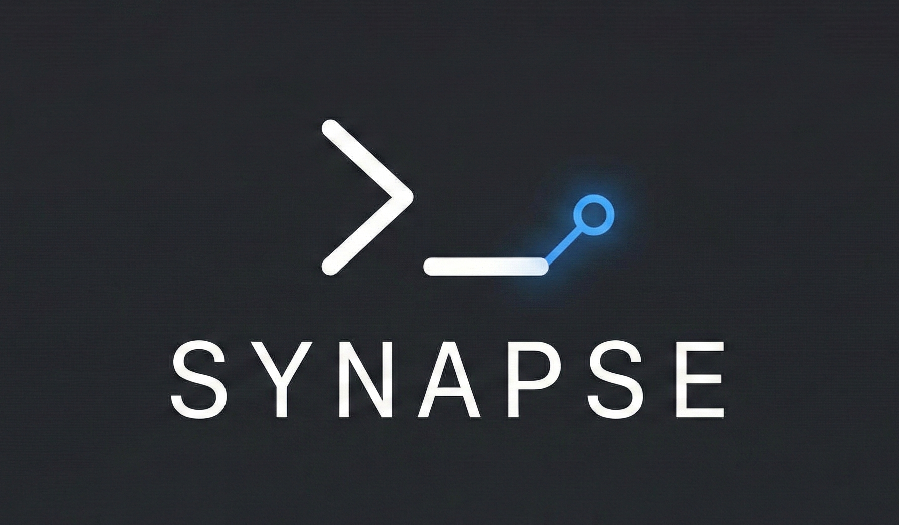

<div align="center">
  
  
  # SYNAPSE
  
  > **The Runtime-First AI Orchestration Console.**
  
  [](https://www.rust-lang.org/)
  [](LICENSE)
  [](CHANGELOG.md)
</div>

---

**SYNAPSE** is not a text editor. It is an **Operator Console**.

Current "AI Editors" (Cursor, VS Code) are stuck in the past: they put the text buffer in the center and the AI in a sidebar. **SYNAPSE flips the paradigm.** In the age of autonomous agents, the human role shifts from *Typist* to *Orchestrator*.

SYNAPSE places the **Runtime (Terminal)** at the center stage. It is a low-level, GPU-accelerated environment designed to run, monitor, and direct multiple AI CLI agents simultaneously in real-time.

---

## 📚 Documentation

- **[Complete Features List](COMPLETE_FEATURES.md)** - Comprehensive overview of all features
- **[Features Guide](FEATURES.md)** - Detailed feature documentation
- **[Changelog](CHANGELOG.md)** - Version history and updates
- **[Future Improvements](FUTURE_IMPROVEMENTS.md)** - Roadmap and planned features

---

## ⚡ The Philosophy

* **Terminal-First:** The code is the artifact; the execution is the reality. The screen real estate is dedicated to `stdout`, logs, and agent interactions.
* **Native Speed:** No Electron. No HTML/CSS. Built entirely in **Rust** using **GPUI**, the same rendering engine powering Zed. It renders at the refresh rate of your monitor.
* **The "Lens" Editor:** Editing is surgical. When you need to write code, the editor appears as a high-contrast modal "lens" over the runtime, then vanishes when you return to orchestration.

## 🛠 Tech Stack

Designed for zero latency and maximum throughput.

* **Core Language:** [Rust](https://www.rust-lang.org/) (Safety, Concurrency, Speed).
* **UI Engine:** [GPUI](https://github.com/zed-industries/zed/tree/main/crates/gpui) (GPU-accelerated, Immediate Mode feel, Retained Mode structure).
  * *MacOS:* Metal API.
  * *Windows:* Vulkan / DX12.
* **Terminal Backend:** [`portable-pty`](https://github.com/wez/wezterm/tree/main/crates/portable-pty) (Robust cross-platform PTY management).
* **Async Runtime:** `tokio` for handling concurrent AI streams.

## 🖥️ UI Layout: "The Command Deck"

The interface is divided into three functional zones:

1. **Zone A: The Grid (Center - 60-85%)**
   A tiling window manager for CLI processes. Run your `Test Agent` in the top-left, `Refactor Agent` in the top-right, and `Server Logs` in the bottom.

2. **Zone B: The Roster (Sidebar - 15%)**
   A live view of active assets: File Tree, Active Agent Processes, and System Telemetry (CPU/RAM usage of local models).

3. **Zone C: The Lens (Overlay)**
   A transient, translucent code editor for manual intervention.

## ✨ Key Features

### 🤖 AI CLI Integration
- **Aider** - AI pair programming tool
- **GPT-Pilot** - AI software development platform
- **Cursor CLI** - Cursor editor CLI interface
- **Continue** - Open-source autopilot
- Auto-detection of installed tools
- Custom tool configuration

### 📜 Scripting Engine
- **Lua** scripting support
- **JavaScript** execution
- **Python** script execution
- **Shell** (Bash/Zsh) scripts
- Script editor with syntax highlighting
- Script library management

### 🎨 Theme System
- **5 Built-in Themes**: Dark, Light, Synthwave, Dracula, Nord
- Custom theme creation
- Theme import/export (JSON)
- Color and font customization

### ♿ Accessibility Features
- **Text-to-Speech (TTS)** - macOS `say`, Linux `espeak` support
- **Speech Recognition** - Voice commands and dictation
- High contrast mode
- Large text option
- Screen reader support

### 📖 Built-in Documentation
- Getting Started guide
- AI Integration guide
- Scripting guide
- Theme Customization guide
- Troubleshooting guide

### 📊 Analytics & Monitoring
- **Report Window** - Track agent execution with metrics
- **Log Panel** - Comprehensive logging with filtering
- **Status Bar** - Real-time system information
- **Agent Management** - Lifecycle management for AI agents

### 💻 Code Editor
- Syntax highlighting for multiple languages
- Line numbers
- Code tokenization
- Language detection

## 🚀 Getting Started

### Prerequisites

* Rust toolchain (`cargo`, `rustc`) - Version 1.88+
* macOS (Windows and Linux support coming soon)
* Metal Toolchain (for macOS) - Install with: `xcodebuild -downloadComponent MetalToolchain`

### Installation

```bash
# Clone the repository
git clone https://github.com/makalin/synapse.git

# Enter directory
cd synapse

# Build in release mode (Recommended for GPU performance)
cargo build --release

# Run the application
cargo run --release
```

### First Steps

1. **Create Your First Terminal**
   - Press `Cmd+N` or use the File menu
   - A new terminal will appear in the grid

2. **Explore the Interface**
   - **Grid**: Center area for terminals and processes
   - **Roster**: Sidebar showing file tree and active agents
   - **Lens**: Overlay code editor (toggle with View menu)

3. **Connect AI Tools**
   - Go to AI CLI Tools panel
   - SYNAPSE will auto-detect installed tools
   - Configure API keys in Settings

## 📦 Project Structure

```
src/
├── main.rs              - Application entry point
├── app.rs               - Main application orchestrator
├── grid.rs              - Terminal tiling manager
├── terminal.rs          - PTY-based terminal
├── lens.rs              - Code editor overlay
├── roster.rs            - Sidebar component
├── settings.rs          - Settings management
├── settings_ui.rs       - Settings UI
├── report.rs            - Report window
├── logs.rs              - Log tracking panel
├── status_bar.rs        - Status bar
├── agent.rs             - Agent management
├── ai_cli.rs            - AI CLI integration
├── scripting.rs         - Scripting engine
├── themes.rs            - Theme system
├── accessibility.rs     - TTS and accessibility
├── guides.rs            - How-to guides
├── changelog.rs         - Changelog viewer
└── code_editor.rs       - Code editor with syntax highlighting
```

## 🗺️ Roadmap

### ✅ Completed (v0.2.0)
- [x] **Core:** GPUI window with tiling layouts
- [x] **Pty:** `portable-pty` integration for real shells
- [x] **UI:** "Lens" modal editor
- [x] **Agents:** AI CLI tool integration (Aider, GPT-Pilot, Cursor CLI, Continue)
- [x] **Scripting:** Lua, JavaScript, Python, Shell support
- [x] **Themes:** 5 built-in themes + custom theme support
- [x] **Accessibility:** TTS and speech recognition
- [x] **Documentation:** Built-in guides and changelog

### 🚧 In Progress
- [ ] **Remote:** SSH Tunneling support for remote server orchestration
- [ ] **Performance:** GPU acceleration optimizations
- [ ] **Windows/Linux:** Cross-platform support

### 🔮 Planned
- [ ] **Multi-window support**
- [ ] **Plugin system**
- [ ] **Cloud sync**
- [ ] **LSP integration**
- [ ] **Git integration**

See [FUTURE_IMPROVEMENTS.md](FUTURE_IMPROVEMENTS.md) for the complete roadmap.

## 🤝 Contributing

This is a low-level engineering challenge and we're looking for contributors interested in:

* Rust Systems Programming
* GPU Rendering & Shaders
* Terminal Emulators (ANSI/VT100 parsing)
* CRDTs for text buffers
* AI/ML Integration
* Accessibility Features

Please check the [Issues](https://github.com/makalin/synapse/issues) page for current tasks.

### Areas Where Help is Needed

1. **Testing**: Help test new features and report bugs
2. **Documentation**: Improve guides and documentation
3. **Themes**: Create and share new themes
4. **Plugins**: Develop useful plugins
5. **Bug fixes**: Fix issues and improve stability
6. **Performance**: Optimize slow areas
7. **Accessibility**: Improve accessibility features

## 📝 License

This project is licensed under the MIT License - see the [LICENSE](LICENSE) file for details.

## 👤 Author

**Mehmet T. AKALIN**

* **GitHub:** [@makalin](https://github.com/makalin)
* **Web:** [dv.com.tr](https://dv.com.tr)
* **X (Twitter):** [@makalin](https://x.com/makalin)

---

<div align="center">

*"Don't just edit. Orchestrate."*

**SYNAPSE** - The Runtime-First AI Orchestration Console

[Features](COMPLETE_FEATURES.md) • [Changelog](CHANGELOG.md) • [Roadmap](FUTURE_IMPROVEMENTS.md) • [Issues](https://github.com/makalin/synapse/issues)

</div>
